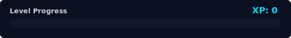
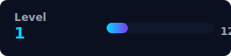

<div align="center">

<!-- ══════════════════════════════════════════════════════════ -->
<!--                     HERO BANNER                           -->
<!-- ══════════════════════════════════════════════════════════ -->


<!-- Typing SVG -->
<a href="https://git.io/typing-svg">
  
</a>

<br/>

<!-- Visitor badge -->

&nbsp;


<br/><br/>

<!-- Socials -->
<a href="https://github.com/ADI-2903">
  
</a>&nbsp;
<a href="https://www.linkedin.com/in/aditya-jain29/">
  
</a>&nbsp;
<a href="mailto:adityajain2903@gmail.com">
  
</a>

</div>

---

<!-- ══════════════════════════════════════════════════════════ -->
<!--                    ABOUT ME                               -->
<!-- ══════════════════════════════════════════════════════════ -->

## 🧠 About Me

```yaml
name        : Aditya Jain
alias       : Adi
location    : India 🇮🇳
focus       : Agentic AI  |  Full-Stack  |  Linux
currently   : Building intelligent, self-driving software systems
learning    : LLMs, RAG pipelines, Distributed Systems
fun_fact    : I automate things so I can be lazy with style 😎
open_to     : Collaborations, Open-Source, Internships
```

---

<!-- ══════════════════════════════════════════════════════════ -->
<!--                  WHAT I'M BUILDING                        -->
<!-- ══════════════════════════════════════════════════════════ -->

## 🚀 Currently Building

| Project | Stack | Status |
|---------|-------|--------|
| 🤖 Agentic AI Platform | Python, LLMs, RAG | 🔨 Active |
| 📊 Attendance Vault | Next.js, Supabase | 🔨 Active |
| 🌐 Personal Intro Site | React, Three.js | 🔨 Active |
| 🧩 Chrome AI Extension | TS, Gemini API | ✅ Shipped |

---

<!-- ══════════════════════════════════════════════════════════ -->
<!--                    TECH STACK                             -->
<!-- ══════════════════════════════════════════════════════════ -->

## 🛠️ Tech Stack

**Languages**

<p>
  
</p>

**Frontend**

<p>
  
</p>

**Backend & Infra**

<p>
  
</p>

**AI / ML Tools**

<p>
  
  &nbsp;
  &nbsp;
  &nbsp;
</p>

**Dev Tools**

<p>
  
</p>

---

<!-- ══════════════════════════════════════════════════════════ -->
<!--                   GITHUB STATS                            -->
<!-- ══════════════════════════════════════════════════════════ -->

## 📊 GitHub Stats

<div align="center">


</div>

<div align="center">


</div>

---

<!-- ══════════════════════════════════════════════════════════ -->
<!--                  ACTIVITY GRAPH                           -->
<!-- ══════════════════════════════════════════════════════════ -->

## 📈 Contribution Graph


---

<!-- ══════════════════════════════════════════════════════════ -->
<!--                  XP GAMIFICATION                          -->
<!-- ══════════════════════════════════════════════════════════ -->

## 🎮 XP & Level

<p align="center">
  
  &nbsp;&nbsp;
  
</p>

> 💡 *XP updates automatically when `.xp` is edited and pushed. Each 100 XP = 1 Level.*

---

<!-- ══════════════════════════════════════════════════════════ -->
<!--                CONTRIBUTION SNAKE                         -->
<!-- ══════════════════════════════════════════════════════════ -->

## 🐍 Contribution Snake

<picture>
  <source media="(prefers-color-scheme: dark)" srcset="https://raw.githubusercontent.com/ADI-2903/ADI-2903/output/github-contribution-grid-snake-dark.svg"/>
  <source media="(prefers-color-scheme: light)" srcset="https://raw.githubusercontent.com/ADI-2903/ADI-2903/output/github-contribution-grid-snake.svg"/>
  
</picture>

---

<!-- ══════════════════════════════════════════════════════════ -->
<!--                  RECENT ACTIVITY                          -->
<!-- ══════════════════════════════════════════════════════════ -->

## ⚡ Recent Activity

<!--START_SECTION:activity-->
<!--END_SECTION:activity-->

---

<!-- ══════════════════════════════════════════════════════════ -->
<!--                 DEV QUOTE OF THE DAY                      -->
<!-- ══════════════════════════════════════════════════════════ -->

## 💬 Dev Quote

<div align="center">

[](https://github.com/piyushsuthar/github-readme-quotes)

</div>

---

<!-- ══════════════════════════════════════════════════════════ -->
<!--                      FOOTER                               -->
<!-- ══════════════════════════════════════════════════════════ -->

<div align="center">
  <sub>⚡ Powered by GitHub Actions &nbsp;|&nbsp; Built with ❤️ by <a href="https://github.com/ADI-2903">Adi</a></sub>
</div>


