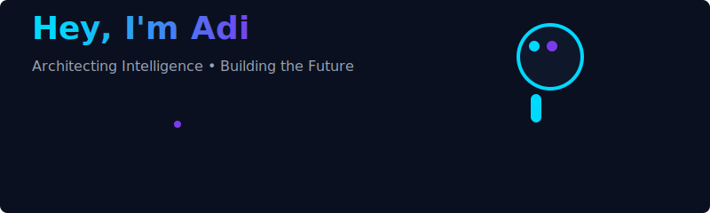

<div align="center">

<!-- Hero Section -->


<a href="https://git.io/typing-svg"></a>

<br/>
<div align="center">
  

  <p>
    <a href="https://github.com/ADI-2903"></a>
    <a href="https://www.linkedin.com/in/aditya-jain29/"></a>
    <a href="mailto:adityajain2903@gmail.com"></a>
  </p>

</div>

## ⚡ Gamified GitHub Profile

Welcome — this README is an animated, game-like profile hub that shows your level, XP and highlights.

<p align="center">
  
  
</p>

### What this includes
- Animated hero SVG (`assets/hero.svg`).
- Animated progress bar (`assets/progress.svg`).
- XP badge generator script: `scripts/generate_xp_badge.py` (reads `.xp`).
- GitHub Action: `.github/workflows/update-xp.yml` to regenerate the badge on push or manual trigger.

### How to update your XP (locally)
Edit the `.xp` file (single integer) then run:
```bash
python scripts/generate_xp_badge.py
```
Commit and push — the workflow will also run when `.xp` changes.

### Make it cooler / next ideas
- Regenerate contribution SVGs with `github-contribution-grid-snake` or `github-profile-3d-contrib` and add them under `assets/`.
- Replace static SVGs with images/GIFs created in Blender/After Effects and push to `assets/`.
- Add a CI job that mints an animated badge based on repo activity (advanced).

If you want, I can:
- Generate additional animated SVGs and themes.
- Add a small script to increment XP when you make commits.
- Suggest and list designers/developers (Fiverr/Upwork/Dribbble) you can hire to polish visuals.

<!--START_SECTION:activity-->

<!--END_SECTION:activity-->

---

<div align="center">
  <small>Built with ❤️ — let's keep iterating. Ask me to add more animations or gamified rules.</small>
</div>
<td align="center" width="33%">
