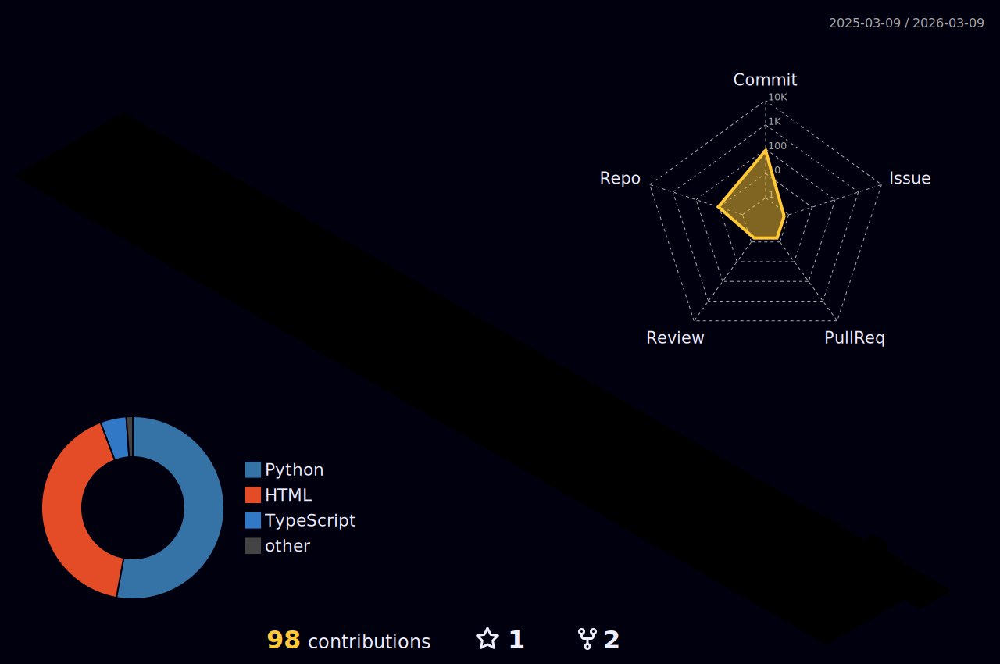

<!-- Hero Section -->

 

<!-- Social Badges with Glow Effect -->

  
  
  

 

<!-- About Section in a Terminal Style -->

<h3 align="center">
  <samp>&gt; Architecting Intelligence. Democratizing AI. Building the Future.</samp>
</h3>

<!-- Tech Stack with Neon Theme -->
<h2>⚡ Tech Arsenal</h2>

<table align="center" width="100%">
<tr>
<td align="center" width="33%">
<h3>🧠 Intelligence</h3>

 

 

</td>
<td align="center" width="33%">
<h3>💻 Core</h3>

 

 

</td>
<td align="center" width="33%">
<h3>🌐 Web</h3>

 

 

</td>
</tr>
</table>

<!-- Featured Project -->
<h2>🚀 Flagship Project</h2>

<table align="center">
<tr>
<td width="50%" align="center">

### 🖥️ **AdiOS**
*> Interactive Linux Learning CLI*

`Python` • `Flask` • `React` • `Vercel`

</td>
<td width="50%" align="center">

### ⚡ **OptionX**
*> Quant Trading Engine (ML + Finance)*

`Python` • `Scikit-Learn` • `Pandas` • `Math`

</td>
</tr>
<tr>
<td width="50%" align="center">

### 🛡️ **Safe-Scan Lite**
*> AI-Powered QR Phishing Scanner*

`React` • `FastAPI` • `Security`

</td>
<td width="50%" align="center">

### 🌾 **FarmSight AI**
*> Voice-First AgriTech Intelligence*

`Google GenAI` • `React 19` • `Audio`

</td>
</tr>
</table>

<!-- Stats Section - Only Working Elements -->
<h2>📊 Metrics</h2>

  

  

<!-- Snake Animation -->

  

<!-- 3D Contrib Graph -->

<!-- Activity Feed -->
<h2>⚡ Recent Activity</h2>

<!--START_SECTION:activity-->
- 🔱 **Forked** [firstcontributions/first-contributions](https://github.com/firstcontributions/first-contributions)
<!--END_SECTION:activity-->

 

