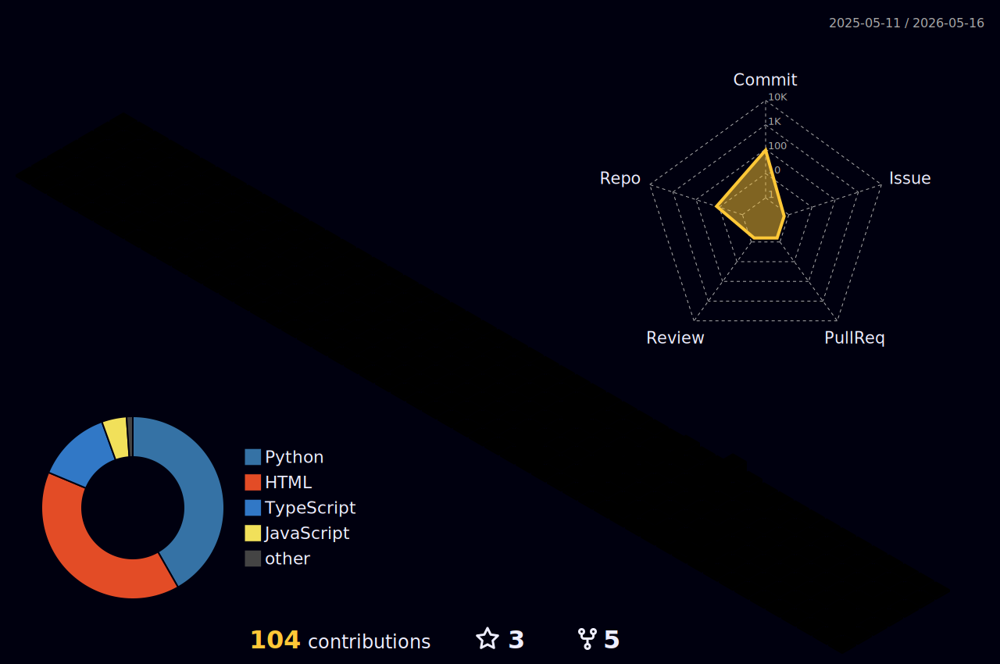
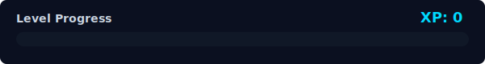
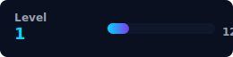

<div align="center">

<!-- ══════════════════════════════════════════════════════════ -->
<!--                     HERO BANNER                           -->
<!-- ══════════════════════════════════════════════════════════ -->


<!-- Typing SVG -->
<a href="https://git.io/typing-svg">
  
</a>

<br/>

<!-- Socials & Badges -->
<a href="https://github.com/ADI-2903">
  
</a>&nbsp;
<a href="https://www.linkedin.com/in/aditya-jain29/">
  
</a>&nbsp;
<a href="mailto:adityajain2903@gmail.com">
  
</a>

<br/><br/>


&nbsp;


</div>

---

<!-- ══════════════════════════════════════════════════════════ -->
<!--                    ABOUT ME                               -->
<!-- ══════════════════════════════════════════════════════════ -->

## 🧠 About Me

```yaml
name        : Aditya Jain
alias       : Adi
location    : India 🇮🇳
focus       : Agentic AI  |  Full-Stack  |  Linux
currently   : Building intelligent, self-driving software systems
learning    : LLMs, RAG pipelines, Distributed Systems
fun_fact    : I automate things so I can be lazy with style 😎
open_to     : Collaborations, Open-Source, Internships
```

---

<!-- ══════════════════════════════════════════════════════════ -->
<!--                  WHAT I'M BUILDING                        -->
<!-- ══════════════════════════════════════════════════════════ -->

## 🚀 Currently Building

| Project | Stack | Status |
|---------|-------|--------|
| 🤖 Agentic AI Platform | Python, LLMs, RAG | 🔨 Active |
| 📊 Attendance Vault | Next.js, Supabase | 🔨 Active |
| 🌐 Personal Intro Site | React, Three.js | 🔨 Active |
| 🧩 Chrome AI Extension | TS, Gemini API | ✅ Shipped |

---

<!-- ══════════════════════════════════════════════════════════ -->
<!--                    TECH STACK                             -->
<!-- ══════════════════════════════════════════════════════════ -->

## 🛠️ Tech Stack

<div align="center">


</div>

---

<!-- ══════════════════════════════════════════════════════════ -->
<!--                  CONNECT FOUR GAME                        -->
<!-- ══════════════════════════════════════════════════════════ -->

## 🎮 Play Connect Four With Me!

<div align="center">

> **Anyone can play!** Click a column number below to drop your piece. It opens a GitHub Issue → my profile auto-updates within ~30 seconds. 🔴 vs 🟡 — community vs me!

<!-- CONNECT-FOUR:BEGIN -->
_Loading game board... trigger the first move to start!_
<!-- CONNECT-FOUR:END -->

| Drop piece in column: | [1](https://github.com/ADI-2903/ADI-2903/issues/new?title=connect-four%7C1&body=Just+click+%27Submit+new+issue%27.+You+don%27t+need+to+do+anything+else!) | [2](https://github.com/ADI-2903/ADI-2903/issues/new?title=connect-four%7C2&body=Just+click+%27Submit+new+issue%27.+You+don%27t+need+to+do+anything+else!) | [3](https://github.com/ADI-2903/ADI-2903/issues/new?title=connect-four%7C3&body=Just+click+%27Submit+new+issue%27.+You+don%27t+need+to+do+anything+else!) | [4](https://github.com/ADI-2903/ADI-2903/issues/new?title=connect-four%7C4&body=Just+click+%27Submit+new+issue%27.+You+don%27t+need+to+do+anything+else!) | [5](https://github.com/ADI-2903/ADI-2903/issues/new?title=connect-four%7C5&body=Just+click+%27Submit+new+issue%27.+You+don%27t+need+to+do+anything+else!) | [6](https://github.com/ADI-2903/ADI-2903/issues/new?title=connect-four%7C6&body=Just+click+%27Submit+new+issue%27.+You+don%27t+need+to+do+anything+else!) | [7](https://github.com/ADI-2903/ADI-2903/issues/new?title=connect-four%7C7&body=Just+click+%27Submit+new+issue%27.+You+don%27t+need+to+do+anything+else!) |
|---|---|---|---|---|---|---|---|

</div>

---

<!-- ══════════════════════════════════════════════════════════ -->
<!--                CONTRIBUTION SNAKE                         -->
<!-- ══════════════════════════════════════════════════════════ -->

## 🐍 Contribution Snake

<picture>
  <source media="(prefers-color-scheme: dark)" srcset="https://raw.githubusercontent.com/ADI-2903/ADI-2903/output/github-contribution-grid-snake-dark.svg"/>
  <source media="(prefers-color-scheme: light)" srcset="https://raw.githubusercontent.com/ADI-2903/ADI-2903/output/github-contribution-grid-snake.svg"/>
  
</picture>

---

<!-- ══════════════════════════════════════════════════════════ -->
<!--                  3D CONTRIBUTION GLOBE                    -->
<!-- ══════════════════════════════════════════════════════════ -->

## 🌐 3D Contribution Globe

<div align="center">

<picture>
  <source media="(prefers-color-scheme: dark)" srcset="profile-3d-contrib/profile-night-rainbow.svg"/>
  <source media="(prefers-color-scheme: light)" srcset="profile-3d-contrib/profile-season-animate.svg"/>
  
</picture>

</div>

---

<!-- ══════════════════════════════════════════════════════════ -->
<!--                   GITHUB SKYLINE                          -->
<!-- ══════════════════════════════════════════════════════════ -->

## 🏙️ GitHub Skyline

<div align="center">

[](https://skyline.github.com/ADI-2903/2025)

<a href="https://skyline.github.com/ADI-2903/2025">
  
</a>

> 🗺️ *My 2025 GitHub contribution history — rendered as an interactive 3D city skyline.*

</div>

---

<!-- ══════════════════════════════════════════════════════════ -->
<!--                   GITHUB STATS                            -->
<!-- ══════════════════════════════════════════════════════════ -->

## 📊 GitHub Stats

<div align="center">


</div>

---

<!-- ══════════════════════════════════════════════════════════ -->
<!--                  ACTIVITY GRAPH                           -->
<!-- ══════════════════════════════════════════════════════════ -->

## 📈 Contribution Graph


---

<!-- ══════════════════════════════════════════════════════════ -->
<!--                  XP GAMIFICATION                          -->
<!-- ══════════════════════════════════════════════════════════ -->

## 🎮 XP & Level

<p align="center">
  
  &nbsp;&nbsp;
  
</p>

> 💡 *XP updates automatically when `.xp` is edited and pushed. Each 100 XP = 1 Level.*

---

<!-- ══════════════════════════════════════════════════════════ -->
<!--                  RECENT ACTIVITY                          -->
<!-- ══════════════════════════════════════════════════════════ -->

## ⚡ Recent Activity

<!--START_SECTION:activity-->
_No recent public activity found._
<!--END_SECTION:activity-->

---

<!-- ══════════════════════════════════════════════════════════ -->
<!--                 DEV QUOTE OF THE DAY                      -->
<!-- ══════════════════════════════════════════════════════════ -->

## 💬 Dev Quote

<div align="center">

[](https://github.com/piyushsuthar/github-readme-quotes)

</div>

---

<!-- ══════════════════════════════════════════════════════════ -->
<!--                      FOOTER                               -->
<!-- ══════════════════════════════════════════════════════════ -->

<div align="center">
  <sub>⚡ Powered by GitHub Actions &nbsp;|&nbsp; Built with ❤️ by <a href="https://github.com/ADI-2903">Adi</a> &nbsp;|&nbsp; 🎮 Play Connect Four above!</sub>
</div>


